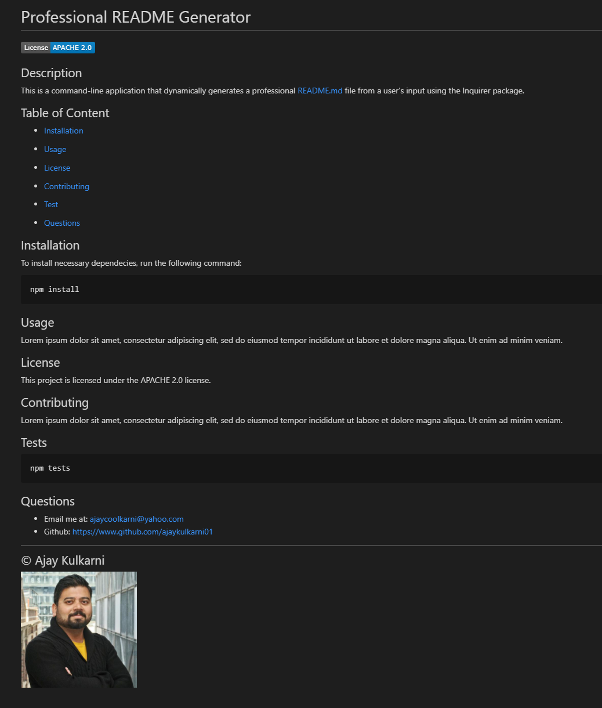

# Unit 09 Node.js: Professional README Generator

For this project, I have created a command-line application that dynamically generates a professional README.md file from a user's input using the [Inquirer package](https://www.npmjs.com/package/inquirer).

The application will be invoked by using the following command:

```bash
node index.js
```

I was presented with the following acceptance criteria:


## 💡 Application Walkthrough

This command line application will ask users set of questions to generate a README file.
It will ask for the:
- Github username
- Email address
- Project name
- Project description
- License information
- Installation procedure
- Usage
- Tests
- Contributors information
Upon entering the answers, the application will generate a professional looking README file.

## Mock-up

Please find below the application screenshot:



## 🔗 Application Demo

https://drive.google.com/file/d/1JRqGbYem0kt3QlN5TRNtsqD-RFEdhPhD/view?usp=sharing

   <br/>

---
